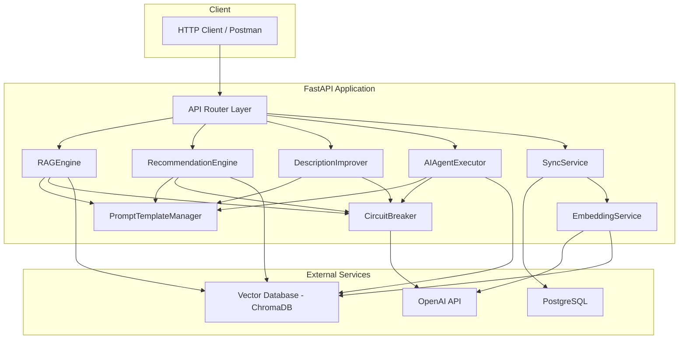

# AI Intelligence Layer — System Documentation

## Table of Contents

- [System Architecture](#system-architecture)
- [Tools and Technologies](#tools-and-technologies)
- [Running Locally](#running-locally)
- [API Endpoints](#api-endpoints)
- [Prompt Templates](#prompt-templates)

---

## System Architecture

### Component Overview

The AI Intelligence Layer extends the Job Board Platform (FastAPI + PostgreSQL) with semantic search, RAG question answering, AI-powered recommendations, description improvement, and an autonomous multi-step reasoning agent.



### Components

| Component | Module | Responsibility |
|---|---|---|
| **RAGEngine** | `app/ai/rag_engine.py` | Retrieval-augmented generation: embeds queries, searches vector DB, builds prompt with context, calls LLM, returns answer with sources |
| **RecommendationEngine** | `app/ai/recommendation_engine.py` | Matches resumes against job post embeddings, uses LLM to rank and score top 5 recommendations |
| **DescriptionImprover** | `app/ai/description_improver.py` | Rewrites job descriptions using mode-specific prompt templates (short, formal, marketing) |
| **AIAgentExecutor** | `app/ai/agent/executor.py` | Autonomous multi-step reasoning agent with ReAct loop, equipped with API, vector search, and LLM tools |
| **EmbeddingService** | `app/ai/embedding_service.py` | Generates vector embeddings via OpenAI with batch support and retry logic |
| **SyncService** | `app/ai/sync_service.py` | Keeps vector DB aligned with PostgreSQL — handles create/update/delete events, supports full re-sync |
| **PromptTemplateManager** | `app/ai/prompt_manager.py` | Loads, validates, and renders YAML-based prompt templates |
| **VectorStoreInterface** | `app/ai/vectorstore/__init__.py` | Abstract interface for vector DB operations (upsert, search, delete, health_check) |
| **ChromaDBStore** | `app/ai/vectorstore/chromadb_store.py` | ChromaDB implementation of the vector store interface |
| **CircuitBreaker** | `app/ai/circuit_breaker.py` | Protects LLM calls with closed/open/half-open circuit states |
| **RetryConfig** | `app/ai/retry.py` | Async retry decorator with exponential backoff for transient failures |

### Data Flow: Query → Response

```
┌─────────┐   GET /ask-ai?query=...   ┌──────────────┐
│  Client  │ ────────────────────────► │  FastAPI     │
└─────────┘                            │  Router      │
                                       └──────┬───────┘
                                              │
                                              ▼
                                       ┌──────────────┐
                                       │  RAGEngine   │
                                       └──────┬───────┘
                                              │
                        ┌─────────────────────┼─────────────────────┐
                        ▼                     ▼                     ▼
                ┌───────────────┐   ┌─────────────────┐   ┌──────────────────┐
                │ OpenAI        │   │ Vector Database  │   │ PromptTemplate   │
                │ (embed query) │   │ (similarity      │   │ Manager          │
                └───────┬───────┘   │  search top 10)  │   │ (render prompt)  │
                        │           └────────┬─────────┘   └────────┬─────────┘
                        │                    │                       │
                        └────────────────────┼───────────────────────┘
                                             ▼
                                    ┌─────────────────┐
                                    │ OpenAI LLM      │
                                    │ (chat completion │
                                    │  with context)   │
                                    └────────┬────────┘
                                             │
                                             ▼
                                    ┌─────────────────┐
                                    │ JSON Response    │
                                    │ {answer, sources}│
                                    └─────────────────┘
```

### Vector Database Collections

| Collection | Source Entity | Embedding Content | Key Metadata |
|---|---|---|---|
| `job_posts` | Job Post | title + description + requirements | entity_id, company_id, location, created_at |
| `companies` | Company | name + description + industry | entity_id, industry, created_at |
| `candidates` | Candidate Profile | skills + experience + bio | entity_id, created_at |

---

## Tools and Technologies

| Technology | Version | Purpose |
|---|---|---|
| **Python** | 3.10+ | Runtime language |
| **FastAPI** | >= 0.104.0 | Async web framework for API endpoints |
| **Uvicorn** | >= 0.24.0 | ASGI server |
| **Pydantic** | >= 2.5.0 | Request/response validation and data models |
| **pydantic-settings** | >= 2.1.0 | Environment-based configuration |
| **PostgreSQL** | — | Primary relational database (existing) |
| **SQLAlchemy** | >= 2.0.0 | ORM and database toolkit |
| **asyncpg** | >= 0.29.0 | Async PostgreSQL driver |
| **Alembic** | >= 1.13.0 | Database migrations |
| **ChromaDB** | >= 0.4.22 | Vector database for embedding storage and similarity search |
| **LangChain** | >= 0.1.0 | LLM orchestration, agent framework, prompt management |
| **langchain-openai** | >= 0.0.5 | OpenAI integration for LangChain |
| **langchain-community** | >= 0.0.10 | Community integrations for LangChain |
| **OpenAI** | >= 1.6.0 | LLM and embeddings API client |
| **OpenAI Models** | gpt-4o-mini, text-embedding-ada-002 | Chat completions and embedding generation |
| **PyYAML** | >= 6.0.1 | Prompt template file parsing |
| **httpx** | >= 0.25.0 | Async HTTP client for internal/external calls |
| **python-dotenv** | >= 1.0.0 | `.env` file loading |
| **pytest** | >= 7.4.0 | Test framework |
| **pytest-asyncio** | >= 0.23.0 | Async test support |
| **Hypothesis** | >= 6.92.0 | Property-based testing |

---

## Running Locally

### Prerequisites

- **Python 3.10+** installed
- **PostgreSQL** running with the Job Board Platform database
- **ChromaDB** (standalone server or embedded mode)

### Environment Variables

Create a `.env` file in the project root:

```env
# Required
OPENAI_API_KEY=sk-your-openai-api-key-here

# Vector Database (defaults shown)
VECTOR_DB_PROVIDER=chromadb
VECTOR_DB_URL=http://localhost:8000
# VECTOR_DB_API_KEY=  (optional, for authenticated vector DB instances)

# OpenAI Models (defaults shown)
OPENAI_EMBEDDING_MODEL=text-embedding-ada-002
OPENAI_CHAT_MODEL=gpt-4o-mini

# RAG Configuration (defaults shown)
RAG_MIN_RELEVANCE_THRESHOLD=0.7
RAG_TOP_K=10
RAG_MAX_QUERY_LENGTH=1000

# Recommendations (defaults shown)
RECOMMEND_TOP_K=10
RECOMMEND_MAX_RESULTS=5

# Agent (defaults shown)
AGENT_MAX_STEPS=10

# Sync (defaults shown)
SYNC_RETRY_MAX=3
SYNC_RETRY_BASE_DELAY=1.0

# Prompts (defaults shown)
PROMPT_TEMPLATES_DIR=app/prompts
```

### Installation

```bash
# Clone the repository and enter the project directory
cd kra-kpa

# Create and activate a virtual environment
python -m venv venv
source venv/bin/activate  # On Windows: venv\Scripts\activate

# Install dependencies
pip install -r requirements.txt
```

### Start ChromaDB

```bash
# Run ChromaDB as a standalone server
chroma run --path ./chroma_data
```

ChromaDB will start on `http://localhost:8000` by default.

### Run Database Migrations

```bash
alembic upgrade head
```

This creates the `embedding_sync_status` table and any other required schema.

### Start the Application

```bash
uvicorn app.main:app --reload
```

The API server will be available at `http://localhost:8000`.

### Sync Embeddings

After starting the application, trigger a full sync to populate the vector database:

```bash
curl -X POST http://localhost:8000/sync/full
```

### Run Tests

```bash
# Run all tests
pytest

# Run with verbose output
pytest -v

# Run only AI-related tests
pytest tests/ -k "ai"
```

---

## API Endpoints

| Method | Endpoint | Description |
|---|---|---|
| `GET` | `/ask-ai?query=...` | Ask a natural language question; returns an answer with sources via RAG |
| `POST` | `/recommend` | Submit resume text; returns up to 5 ranked job recommendations |
| `POST` | `/improve-description` | Submit a job description + mode; returns an improved version |
| `POST` | `/agent/task` | Submit a complex task; agent reasons step-by-step using tools |
| `POST` | `/sync/full` | Trigger a full re-sync of all embeddings from PostgreSQL |

### GET /ask-ai

**Query Parameters:**
- `query` (string, required) — Natural language question (max 1000 characters)

**Success Response (200):**
```json
{
  "answer": "Based on the available listings...",
  "sources": [
    {
      "entity_type": "job_post",
      "entity_id": "123",
      "text_snippet": "Senior Python Developer...",
      "relevance_score": 0.92
    }
  ],
  "query": "What Python jobs are available?"
}
```

**Error Responses:** 400 (invalid query), 503 (LLM unavailable)

### POST /recommend

**Request Body:**
```json
{
  "resume_text": "5 years experience in Python, FastAPI, machine learning..."
}
```

**Success Response (200):**
```json
{
  "recommendations": [
    {
      "job_title": "Senior ML Engineer",
      "job_id": "456",
      "match_reason": "Strong Python and ML background matches requirements",
      "confidence_score": 0.93
    }
  ],
  "message": null
}
```

**Error Responses:** 400 (empty or exceeds 10,000 chars)

### POST /improve-description

**Request Body:**
```json
{
  "description": "We need a developer who knows Python...",
  "mode": "short_and_crisp"
}
```

Valid modes: `short_and_crisp`, `detailed_and_formal`, `marketing_oriented`

**Success Response (200):**
```json
{
  "improved_description": "**Python Developer**\n\n- Build scalable APIs...",
  "mode": "short_and_crisp"
}
```

**Error Responses:** 400 (empty or exceeds 50,000 chars), 422 (invalid mode), 503 (LLM unavailable)

### POST /agent/task

**Request Body:**
```json
{
  "task": "Find all Python developer jobs posted in the last week and summarize them"
}
```

**Success Response (200):**
```json
{
  "answer": "I found 3 Python developer positions...",
  "steps": [
    {
      "tool_name": "vector_search_tool",
      "input": {"query": "Python developer"},
      "output": "Found 3 matching job posts...",
      "reasoning": "Searching for Python developer positions"
    }
  ],
  "completed": true,
  "message": null
}
```

**Error Responses:** 400 (empty task)

### POST /sync/full

**Success Response (200):**
```json
{
  "total_entities": 150,
  "created": 12,
  "updated": 3,
  "deleted": 1,
  "failed": 0,
  "duration_seconds": 45.2
}
```

---

## Prompt Templates

All prompt templates are stored as YAML files in `app/prompts/`. Each file contains:
- `name` — unique template identifier
- `description` — what the template does
- `required_variables` — list of variables that must be provided
- `template` — the prompt text with `{variable_name}` placeholders

### rag_answer

| Field | Value |
|---|---|
| **Template Name** | `rag_answer` |
| **LLM Interaction** | RAG answer generation — produces a natural language answer grounded in retrieved context documents |
| **Usage Scenario** | Invoked by `RAGEngine.answer_query()` when a user submits a question to `GET /ask-ai` |

**Variables:**

| Variable | Type | Source |
|---|---|---|
| `query` | `str` | User's natural language question from the `query` parameter |
| `context_documents` | `str` | Concatenated text snippets from vector similarity search results (top 10, score >= 0.7) |

**Behavior:** Instructs the LLM to answer the question using only the provided context. If the context is insufficient, the LLM states that it cannot answer.

---

### job_recommendation

| Field | Value |
|---|---|
| **Template Name** | `job_recommendation` |
| **LLM Interaction** | Job recommendation ranking — analyzes a resume against job matches and produces structured JSON recommendations |
| **Usage Scenario** | Invoked by `RecommendationEngine.recommend_jobs()` when a user submits a resume to `POST /recommend` |

**Variables:**

| Variable | Type | Source |
|---|---|---|
| `resume_text` | `str` | Candidate's resume/profile text from the request body |
| `job_matches` | `str` | Formatted list of candidate job matches retrieved from vector similarity search on the `job_posts` collection |

**Behavior:** Instructs the LLM to compare the resume against job matches, rank by relevance, and return a JSON array of up to 5 recommendations with job_title, job_id, match_reason, and confidence_score (0.0–1.0).

---

### improve_short_and_crisp

| Field | Value |
|---|---|
| **Template Name** | `improve_short_and_crisp` |
| **LLM Interaction** | Description improvement (short mode) — rewrites a job description to be concise with bullet points |
| **Usage Scenario** | Invoked by `DescriptionImprover.improve()` when `POST /improve-description` is called with `mode: "short_and_crisp"` |

**Variables:**

| Variable | Type | Source |
|---|---|---|
| `job_description` | `str` | Raw job description text from the request body |

**Behavior:** Instructs the LLM to rewrite the description using bullet points, short sentences, removing filler words while retaining all key requirements and qualifications.

---

### improve_detailed_and_formal

| Field | Value |
|---|---|
| **Template Name** | `improve_detailed_and_formal` |
| **LLM Interaction** | Description improvement (formal mode) — rewrites a job description in a professional, comprehensive style |
| **Usage Scenario** | Invoked by `DescriptionImprover.improve()` when `POST /improve-description` is called with `mode: "detailed_and_formal"` |

**Variables:**

| Variable | Type | Source |
|---|---|---|
| `job_description` | `str` | Raw job description text from the request body |

**Behavior:** Instructs the LLM to rewrite the description in formal corporate language, organized into sections: Role Overview, Key Responsibilities, Requirements and Qualifications, and Benefits.

---

### improve_marketing_oriented

| Field | Value |
|---|---|
| **Template Name** | `improve_marketing_oriented` |
| **LLM Interaction** | Description improvement (marketing mode) — rewrites a job description to be engaging and SEO-optimized |
| **Usage Scenario** | Invoked by `DescriptionImprover.improve()` when `POST /improve-description` is called with `mode: "marketing_oriented"` |

**Variables:**

| Variable | Type | Source |
|---|---|---|
| `job_description` | `str` | Raw job description text from the request body |

**Behavior:** Instructs the LLM to rewrite the description with compelling language, action verbs, highlighting growth opportunities and company culture, and incorporating SEO keywords naturally.

---

### agent_reasoning

| Field | Value |
|---|---|
| **Template Name** | `agent_reasoning` |
| **LLM Interaction** | Agent system prompt — provides the AI agent with its task context and tool descriptions for ReAct reasoning |
| **Usage Scenario** | Invoked by `AIAgentExecutor.execute_task()` when a user submits a task to `POST /agent/task` |

**Variables:**

| Variable | Type | Source |
|---|---|---|
| `task` | `str` | Natural language task description from the request body |
| `available_tools` | `str` | Formatted descriptions of available tools (api_query_tool, vector_search_tool, llm_reasoning_tool) with their capabilities |

**Behavior:** Instructs the agent to think step-by-step, choose appropriate tools for each step, evaluate results, and stop when the task is complete or try alternative approaches if a tool fails. The agent is limited to 10 reasoning steps.

---

## Error Handling

All AI endpoints return errors in a consistent format:

```json
{
  "error": "machine_readable_code",
  "message": "Human-readable description of the problem",
  "details": {}
}
```

| HTTP Status | Meaning | When |
|---|---|---|
| 400 | Bad Request | Invalid, missing, or over-length input |
| 422 | Unprocessable Entity | Invalid enum value (e.g., unsupported improvement mode) |
| 503 | Service Unavailable | LLM or vector DB is down / circuit breaker is open |

### Retry Strategy

- OpenAI API errors (429, 500, 502, 503, 504) are retried up to 3 times with exponential backoff (1s → 2s → 4s).
- Non-retryable errors (400, 401, 403) fail immediately.

### Circuit Breaker

The LLM circuit breaker protects against cascading failures:
- **Closed** (normal): requests pass through
- **Open** (tripped): after 5 failures within 60s, returns 503 immediately for 30s
- **Half-open**: after cooldown, allows one test request to check recovery
